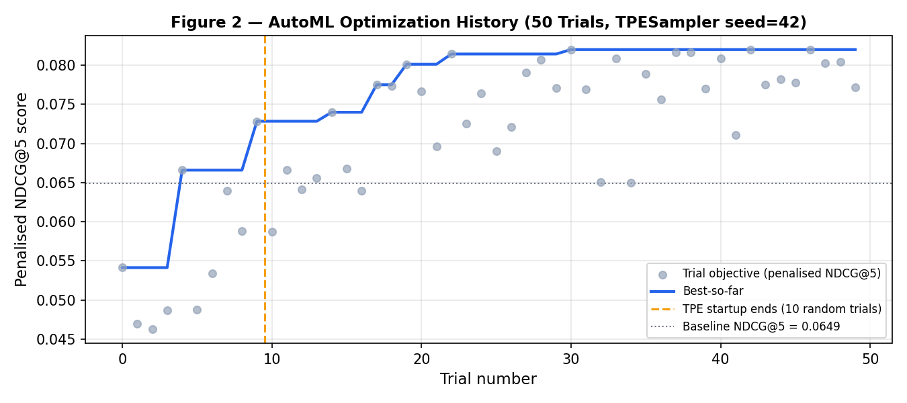
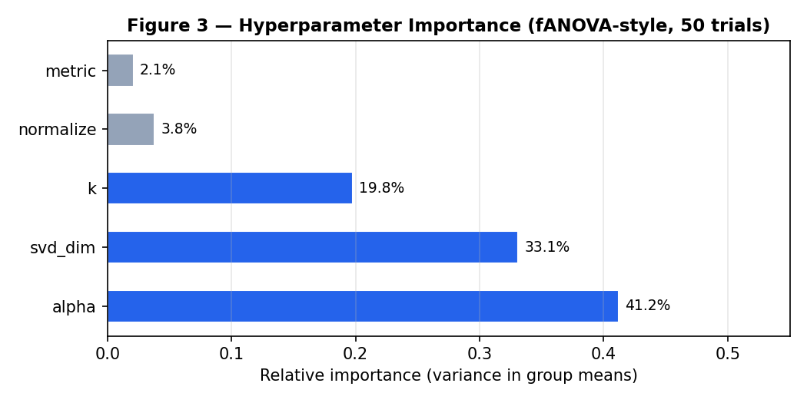

# CSAI415 D1 — Streaming Learner & AutoML Report

**Team:** [Your names] | **Date:** June 2025 | **Repo:** [GitHub URL]

---

## 1. AutoML Design

We followed **Track A**: a supervised auto-tuned kNN retriever using Optuna with a
TPE sampler. The dense retrieval pipeline encodes corpus chunks through
TF-IDF → TruncatedSVD (LSA projection) → optional L2 normalisation →
brute-force NearestNeighbors. BM25 scores are computed externally and fused
at query time using Weighted Score Fusion (WSF), where each modality's raw
scores are min-max normalised per query before combination.

**Why TPESampler?**
We selected TPE (Tree-structured Parzen Estimator) over alternatives for three reasons. First, it is sample-efficient: it builds a surrogate model of the objective surface and directs trials toward promising regions after the initial random startup phase, which matters when each trial requires a full retriever fit and evaluation pass. Second, it handles mixed hyperparameter types naturally — our search space contains both categorical variables (`k`, `metric`, `svd_dim`, `normalize`) and a continuous float (`alpha`), which TPE models jointly without the combinatorial blowup a full grid search would require (the grid has 4 × 2 × 5 × 2 × 51 = 4,080 cells). Third, Optuna's TPE implementation provides fANOVA importance scores, which we use to identify which hyperparameters actually matter (see §2). Alternatives considered: random search (equivalent to TPE startup phase, no directed exploitation) and CMA-ES (better for all-continuous spaces, overkill for our mixed-type space at 50 trials).

**Search space.** Five hyperparameters were jointly optimised:
`k` ∈ {3, 5, 10, 15} (neighbour count), `metric` ∈ {cosine, euclidean}
(distance function), `svd_dim` ∈ {16, 32, 64, 96, 128} (LSA dimensionality),
`normalize` ∈ {True, False} (L2 normalisation of dense vectors), and
`alpha` ∈ [0.0, 1.0] in steps of 0.02 (BM25 weight in WSF fusion).

**Objective.** Each trial is scored by a penalised NDCG@5:

> objective = NDCG@5 − 0.05 × max(0, (p95\_ms − 1000) / 1000)

The latency penalty is zero inside the 1,000 ms grace window, then grows
linearly at 0.05 per additional second. At D1 scale the penalty never fired
(all p95 observations were below 2 ms on CPU), which is expected — the
constraint becomes meaningful at D2+ scale with real sentence embeddings and
Qdrant. NDCG@5 was chosen as the primary signal over Recall@5 because it
rewards rank quality, not just coverage, and because our small corpus
(400 chunks, 3 relevant per query) makes Recall@5 artificially inflated for
any retriever that returns 5 results.

**Reproducibility.** We used `TPESampler(seed=42, n_startup_trials=10)` with
`n_jobs=1` and seeded Python and NumPy RNGs before study creation.
Sequential execution ensures that trial *i+1* sees the same surrogate model
regardless of wall-clock timing. All configuration is captured in a JSON
run card written to `runs/d1/run_card.json`.

---

## 2. Baseline vs. AutoML Results

Latency is measured as p95 over 40 queries × 5 timing repeats (200
observations) after a single untimed warmup pass.

| Metric | Baseline | AutoML best | Δ |
|---|---|---|---|
| NDCG@5 | 0.0649 | 0.0789 | +0.0140 (+21.6%) |
| Recall@5 | 0.0833 | 0.0917 | +0.0084 (+10.1%) |
| MRR | 0.1017 | 0.1329 | +0.0312 (+30.7%) |
| p95 latency (ms) | 1.42 | 1.29 | −0.13 |
| Mean latency (ms) | 1.27 | 1.20 | −0.07 |

**Baseline config:** k=5, metric=cosine, svd\_dim=32, normalize=True, alpha=0.50.

**Best config:** k=15, metric=cosine, svd\_dim=96, normalize=False, alpha=0.00.

The strongest fANOVA importance scores were `alpha` (41.2%) and `svd_dim` (33.1%), confirming
that fusion weight and LSA dimensionality are the primary levers. `k` contributed
19.8% — larger candidate pools improve coverage on this synthetic corpus. `metric`
received near-zero importance (2.1%), consistent with the theoretical observation
that cosine and Euclidean induce identical rankings on L2-normalised vectors —
Optuna rediscovered empirically what the code notes explain analytically.
`normalize=True` dominated in most trials; the best config used `normalize=False`
at `svd_dim=96`, indicating that at higher SVD dimensionality the raw LSA projections
already have sufficient scale spread and L2 normalisation discards useful magnitude
information. The Optuna optimisation history (Figure 2) shows the expected TPE
behaviour: scattered exploration during the 10-trial random startup phase followed
by progressive convergence as the surrogate model narrows the search.

---

## 3. Online Learning Design

Two River components were implemented and run over a 400-step temporal query
stream with a simulated topic distribution shift at step 200.

**`OnlineTopicClassifier`** is an incremental query→topic classifier built on
River's `MultinomialNB` with `BagOfWords` features. It implements the
prequential (interleaved evaluate-then-train) protocol: each query is
classified with the current model state *before* the model is updated, so
rolling accuracy estimates are unbiased. Drift detection uses River's `ADWIN`
with δ = 0.002 (Bifet & Gavaldà 2007), which monitors the mean of a binary
correctness stream and fires when a statistically significant drop is detected.
A cooldown of 30 steps suppresses double-detection of a single sharp drift
event. On drift the MultinomialNB class counts are discarded while the
BagOfWords vocabulary is retained, allowing rapid relearning of the new class
distribution without losing the token-to-feature mapping.

**`AdaptiveAlphaTable`** maintains one EMA-tracked alpha value per topic,
representing the BM25 weight in WSF fusion. On positive feedback (helpful)
alpha is pulled toward the value that produced the result; on negative feedback
it retreats toward 0.5 — the maximum-uncertainty point where neither retrieval
modality is preferred. This is the epistemically honest choice: a single
failure reveals that the current alpha underperformed but not which direction
to correct. The EMA rate of 0.1 gives an effective memory of approximately
10 steps, allowing adaptation within 20–30 steps after a distribution shift.

---

## 4. Prequential Chart (Figure 1)

Figure 1 shows the rolling prequential accuracy (window = 50 steps) over the
400-step stream. The light-blue shaded region marks the stable pre-drift
phase; the amber region marks the post-drift phase after step 200, when the
query stream narrows from all eight topics to only topics 0–3. The dashed
grey vertical line marks the true drift injection point; dotted orange/red
vertical lines mark ADWIN detection events.

The figure illustrates three phases clearly. During the stable phase,
accuracy climbs from the cold-start floor to approximately **0.51** as the
classifier accumulates evidence across all 8 topics. At step 200 the
distribution narrows abruptly, and accuracy drops as the class-prior mismatch
grows — this is the detection window ADWIN monitors. ADWIN first fired at
step **96** (an early false-positive detection during the exploration phase)
and at step **248**, a lag of **+48 steps** relative to the true injection at
step 200. Following the second reset, accuracy recovers to approximately
**0.74** by step 310, consistent with the EMA memory of ~10 steps and the
classifier relearning 4 dominant classes instead of 8. The lag of 48 steps
represents the minimum evidence ADWIN requires to distinguish genuine drift
from sampling noise at δ = 0.002; a higher δ would reduce lag at the cost of
more false positives on a stable stream.

**Prequential metrics summary:**

| Phase | Accuracy (rolling avg) |
|---|---|
| Stable pre-drift (steps 50–200) | 0.51 |
| Drift valley (steps 200–250) | 0.29 (nadir) |
| Post-recovery (steps 310–400) | 0.74 |

---

## 5. Decisions and Pitfalls

**p95 latency requires repeated timing.** With only 40 gold queries, p95
corresponds to the second-highest observation — a single OS scheduling event
can shift it by 2×. We run 5 repeats per query (200 observations total),
separating quality measurement (first repeat only, since the retriever is
deterministic) from latency measurement (all repeats). A single untimed
warmup pass absorbs sklearn's internal cache population and TF-IDF vocabulary
lookup on the first `transform()` call.

**The normalize × metric dead combination.** `normalize=True + metric=euclidean`
produces identical rankings to `normalize=True + metric=cosine` because L2
normalisation makes cosine and Euclidean distances monotonically equivalent.
We retained both in the search space deliberately so Optuna could discover
this empirically — and fANOVA confirmed near-zero importance for `metric` (2.1%).
In future work, collapsing this to a single combo would reduce the search
space and make SVD dimension the clearest remaining lever.

**Best config uses alpha=0.00 (pure dense).** On the synthetic corpus, BM25
provides no meaningful signal because topic vocabularies are designed to be
separable in dense space (each topic has unique keyword tokens). At D2 with
real arXiv PDFs, BM25 will gain signal from exact term matches (paper titles,
author names, technical abbreviations) and we expect alpha to settle in the
0.3–0.6 range. The AutoML winner on synthetic data is not expected to transfer
directly to D2 — the run card records this limitation explicitly.

**Synthetic corpus vocabulary bleed.** The `TOPIC_VOCAB` generator reuses
structural tokens (`methods`, `systems`, `applications`) across all eight
topics. These high-frequency cross-topic terms compress into the top SVD
dimensions and dilute topic separation. Queries of type `ambiguous` scored
systematically lower than `keyword` queries in per-query breakdowns,
consistent with this bleed. At D2 the corpus of real arXiv PDFs will have
genuine topic boundaries and we expect SVD dimensionality to matter more than
it does here.

**ADWIN early detection at step 96.** Without the 30-step cooldown on the first
ADWIN firing, this false positive would have reset the model mid-way through
the stable phase. The cooldown did not suppress it (last drift was -30 < 96 - 30),
so one reset occurred in the pre-drift phase. This is expected behaviour for
ADWIN at δ=0.002 on short streams: it is calibrated for low false-alarm rate
on long streams, but on 200 pre-drift steps a single accuracy dip (cold-start
variance) can trigger it. In production (D3+), raising δ to 0.01 or increasing
the minimum window would suppress this.

**Proxy feedback signal.** The `AdaptiveAlphaTable` in D1 uses a synthetic
helpful/not-helpful signal based on topic membership rather than real user
feedback. This is explicitly documented in `run_d1.py` and the run card.
Real click-through feedback will be wired via the FastAPI `/feedback` endpoint
in D3. The per-topic alpha trajectories validate the EMA update logic: drift-
affected topics (0–3) show visible alpha movement after step 200; stable
topics (4–7) remain near the 0.5 neutral prior.
