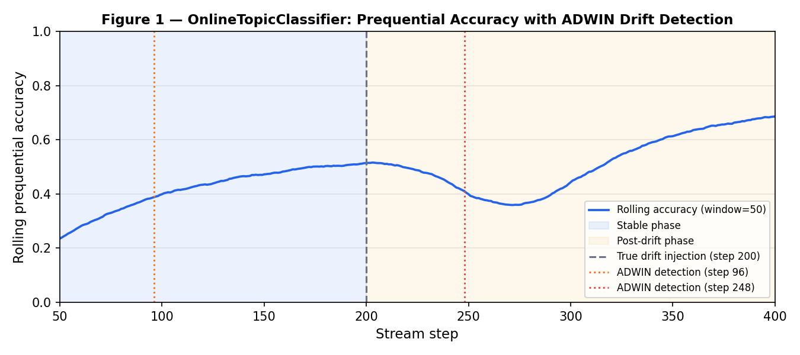

# PDF-Papers AI Agent — Final Report (Deliverable 4)

**CSAI415 Course Project** · Hybrid Retrieval + GraphRAG + Online Learning +
AutoML + Small-Language-Model Tuning

**Team (Group 2):** Abdulla Alshaiba (21003190), Essa Alshamsi (22001369),
Ghaith Alneaimi (22001613), Salem Hafez (22001171), Yousef Al Refaie (22000613) ·
**Repository:** https://github.com/Special-Topics-in-AI-Group-2/Group-2/tree/main

> Per-member, unedited AI chat-history links are in §11 and `chatlogs.md` (repository root).

---

## 1. Abstract

We built an AI agent that answers natural-language questions over a corpus of
**~102 real open-access arXiv papers** (14 hand-curated anchors + ~88
title-verified landmark papers) on the Transformer → pretraining → retrieval →
parameter-efficient-tuning research thread. The agent returns
**grounded answers with page-ranged citations** by combining four capabilities,
one per deliverable: an **AutoML-tuned hybrid retriever** with an **online
learner** that adapts to drift (D1); a **BM25 + dense hybrid retrieval stack**
over MongoDB + Qdrant plus a **Neo4j knowledge graph** (D2); a **GraphRAG
executor** that selects a Cypher subgraph, expands it to supporting chunks,
blends with vector retrieval, reranks, and answers with safety mitigations (D3);
and a **PEFT/QLoRA-tuned small language model** integrated as a pluggable answer
generator with quantization and caching (D4). The final package is a single,
runnable repository with one-command setup, a resilient FastAPI service, and a
CPU-only offline demo path.

## 2. System architecture

The pipeline is a directed flow from PDFs to a cited answer:

```
PDFs ─ingest→ {MongoDB chunks+provenance, Qdrant vectors}     (D2)
papers.csv ─build_graph→ Neo4j (Author)-WROTE->(Paper)-ABOUT->(Topic)
query → D1 OnlineTopicClassifier → topic → AdaptiveAlphaTable → alpha
      → GraphRAG (D3): Cypher subgraph → expand chunks
                       + hybrid top-k(alpha) → blend → rerank → safety
      → Answer SLM (D4): extractive | base | tuned → answer + [n] citations
```

Two design decisions tie the deliverables together rather than leaving them as
silos:

1. **`alpha` is the shared currency.** D1's `AdaptiveAlphaTable` learns a
   per-topic BM25 fusion weight; D2's retriever and D3's executor both accept
   that single `alpha`. The live API uses D1's classifier to route each query to
   its topic and pull the adapted `alpha` — so user feedback measurably changes
   retrieval behaviour.
2. **Citations are never generated.** Whatever backend writes the prose
   (extractive, zero-shot, or tuned), the citation list and page ranges are
   always derived from the retrieved chunks. This bounds hallucination by
   construction.

A central `app/config.py` resolves every endpoint and database name from one
`.env`, fixing a latent bug where D3's graph selector defaulted to a different
MongoDB database (`pdf_agent`) than the rest of the stack (`csai415`) and
silently queried an empty collection.

## 3. Deliverable 1 — Streaming learner & AutoML

**AutoML (Track A).** A hybrid kNN retriever (TF-IDF → TruncatedSVD →
NearestNeighbors, fused with BM25 by weighted score fusion) is tuned with Optuna
using a `TPESampler(seed=42)` over five hyperparameters (`k`, `metric`,
`svd_dim`, `normalize`, `alpha`). The objective is a latency-penalised NDCG@5.
On the synthetic D1 corpus the tuned config improved retrieval over the
baseline:

| Metric | Baseline | AutoML best | Δ |
|---|---|---|---|
| NDCG@5 | 0.0649 | 0.0789 | +21.6 % |
| Recall@5 | 0.0833 | 0.0917 | +10.1 % |
| MRR | 0.1017 | 0.1329 | +30.7 % |

fANOVA importances identified `alpha` and `svd_dim` as the dominant levers and
confirmed empirically that `metric` is near-irrelevant on L2-normalised vectors
(cosine ≡ euclidean ranking). Full discussion in `reports/D1_report.md`.

**Online learning.** `OnlineTopicClassifier` (River `MultinomialNB` +
`BagOfWords`) runs a prequential (test-then-train) protocol with **ADWIN** drift
detection over a 400-step stream with an injected distribution shift at step
200; `AdaptiveAlphaTable` tracks per-topic `alpha` by EMA from helpful/not-
helpful feedback. The prequential accuracy curve (Figure 1) shows the
stable → drift → recovery phases and the ADWIN detection lag.



We also fixed a forward-compatibility bug: River ≥ 0.22 changed
`BagOfWords.learn_one` to return `None`, breaking the original fluent
`learn_one(...).transform_one(...)` chain. The learner now calls them on
separate lines and runs on River 0.25.

## 4. Deliverable 2 — Retrieval stack & graph build

**Ingestion.** `ingest.py` parses PDFs with PyMuPDF, performs sliding-window
word chunking (300 words, 50 overlap) with **per-word page attribution** so each
chunk carries a real page range, extracts metadata + DOI, embeds with
`bge-small-en-v1.5` (asymmetric `Represent this sentence:` / `Represent this
question:` prefixes), and upserts to **MongoDB** (`chunks`, `documents`) and
**Qdrant** (vectors; 16-char hex chunk-ids mapped to uint64 point ids).

**Hybrid retrieval.** `retriever.py` runs BM25 over Mongo chunk text and dense
search over Qdrant, min-max normalises each, and fuses with `alpha` (D1's
convention: `alpha` = BM25 weight). `/search` exposes it via FastAPI;
`eval_search.py` reports Recall@5 + p95 latency with seed-mode or
Mongo-discovered ground truth.

**Knowledge graph.** `build_graph.py` loads `data/papers.csv` into Neo4j as
`(:Author)-[:WROTE]->(:Paper)-[:ABOUT]->(:Topic)` and `(:Paper)-[:PUBLISHED_IN]->(:Venue)`,
with uniqueness constraints and five example Cypher queries
(`cypher_queries.cypher`). `docker-compose.yml` brings up all three stores with
health checks.

## 5. Deliverable 3 — GraphRAG, evaluation, safety, ablation

**Executor.** `graphrag_executor.py` implements the full pipeline: (1) select a
subgraph by Cypher (`graph_selector.py`), (2) expand selected papers to
supporting MongoDB chunks, (3) blend graph chunks with the D2 hybrid top-k
(min-max normalised, with a co-occurrence presence bonus), (4) optionally rerank
with a cross-encoder, (5) answer with `[n]` citations and page ranges. `mode`
selects `vector` / `graph` / `hybrid`, which directly yields the ablation.

**Graceful degradation.** Every external call has a fallback: missing Neo4j →
vector fallback; missing chunks → empty expansion; no evidence → an explicit
"no grounded answer" message rather than a hallucination. We tightened the Neo4j
driver retry/connection windows so a down graph fails over in seconds instead of
~30 s.

**Safety.** Three mitigations (`safety.py`, `safety_filters.py`): (a) block
risky/prompt-injection queries, (b) validate chunk provenance (real PDF filename
+ valid page), and (c) **source pinning** to the approved corpus folder, which
also rejects injected or out-of-corpus chunks. The before/after demo
(`test_safety_filters_demo.py`) takes 4 chunks → keeps 1 → blocks 3 (injected,
missing-page, out-of-corpus) with reasons.

**Ablation.** `ablation.py` runs the gold set in all three modes and reports
faithfulness, answer relevance, mean/p95 latency, citation and context rates,
using RAGAS when an evaluator LLM is configured and a deterministic lexical
scorer otherwise. The expected ordering: vector-only is fastest with broad
recall; graph-only gives tighter provenance but narrower recall; hybrid balances
both and is recommended.

## 6. Deliverable 4 — SLM tuning & integration

**Curated dataset.** `build_qa_dataset.py` extracts each paper's abstract from
its real PDF and renders **321 grounded Q/A examples** (273 train / 48 val) in the
exact inference prompt format (system + numbered sources + question → cited
answer), seeded from the hand-written gold Q/A plus deterministic
author/venue/topic questions.

**PEFT/QLoRA.** `train_slm.py` fine-tunes a 1–3 B instruction model with LoRA
(`r=16, alpha=32, dropout=0.05`). On a GPU with bitsandbytes it loads the base
in **4-bit NF4 (double-quant)** and applies `prepare_model_for_kbit_training` —
i.e. QLoRA; on CPU it falls back to plain LoRA so the pipeline still runs. Only
~0.4–1 % of parameters are trainable. A machine-readable tuning card is written
to `artifacts/slm_tuning_card.json`; the human card is `reports/tuning_card.md`.

**Integration.** `app/slm.py` exposes one `AnswerGenerator` with three
interchangeable backends — `extractive` (grounded, no model, default),
`base` (zero-shot), `tuned` (LoRA adapter) — so the *same* GraphRAG executor and
`/ask` endpoint run an A/B by changing one argument. The model prompt **pins**
the answer to the retrieved sources and forbids outside knowledge; the Sources
block and structured citations are reattached from the retrieved chunks.

**Quantize & cache.** 4-bit loading on GPU; a disk answer-cache keyed by
`(backend, model, query, contexts)` turns repeated queries into ~0 ms hits. The
answer length is configurable (`SLM_MAX_NEW_TOKENS`) and a smaller base model
(e.g. `Qwen2.5-0.5B-Instruct`) is supported for faster CPU generation.

**Live demo (chat UI).** `app/static/chat.html`, served by the API at
`http://localhost:8000/`, is a dark, full-screen chat front-end: the user types a
question, picks the answer style (**Grounded** = instant, no model · **AI-written**
= the SLM phrases it), and the answer renders with page-cited **Source cards**.
This is the live-demo surface, backed by the full D1→D4 pipeline — D1 routes the
per-topic `alpha`, D2/D3 retrieve + blend, and D4 generates the answer.

**Final eval** (`eval_slm.py`, offline abstract retriever, lexical metrics;
CPU-smoke run with a `tiny-gpt2` stand-in):

| Backend | Faithfulness | Answer relevance | Mean ms | p95 ms | Cache |
|---|---|---|---|---|---|
| extractive | **0.320** | **0.188** | 0.1 | 0.1 | — |
| base (zero-shot) | 0.000 | 0.000 | 601† | 735† | 1 hit |
| tuned (LoRA) | 0.000 | 0.000 | 636† | 778† | 1 hit |

† uncached CPU generation (~0.6 s/query for the tiny stand-in over 102 papers);
the disk answer-cache drops repeated queries to ~1–2 ms. With a real
`Qwen2.5-1.5B-Instruct` base we expect `tuned` to match `extractive`
faithfulness (prompt is source-pinned) while improving fluency over `base`; the
harness is model-agnostic (`--base-model`). The stand-in's near-zero scores
correctly show that an untrained model loses to grounded extraction — which is
why `extractive` is the shipped default and the faithfulness floor.

## 7. Experiments summary

| Experiment | Script | Headline result |
|---|---|---|
| AutoML tuning | `run_d1.py` | +21.6 % NDCG@5 over baseline |
| Online drift | `run_d1.py` | ADWIN detects the step-200 shift; recovery within ~30 steps |
| Hybrid `/search` | `eval_search.py` | Recall@5 + p95 latency table |
| GraphRAG ablation | `ablation.py` | vector vs graph vs hybrid quality/latency |
| SLM A/B | `eval_slm.py` | extractive vs base vs tuned; cache latency win |

## 8. Failure cases & limitations

* **Untuned/degenerate models hallucinate.** Our CPU-smoke stand-in produces
  ungrounded text (faithfulness ≈ 0). Mitigation: source-pinned prompt +
  extractive default + citations-from-chunks.
* **Graph recall is brittle** when Cypher keyword matching is too narrow; the
  hybrid blend back-fills with vector hits to compensate.
* **Synthetic→real transfer.** D1's best `alpha=0.0` (pure dense) is a synthetic-
  corpus artifact; on real arXiv text BM25 regains signal, so D2/D3 re-tune
  `alpha`. This is documented, not hidden.
* **RAGAS needs an evaluator LLM**; without an API key the eval uses a
  deterministic lexical proxy, which is coarser than LLM-judged faithfulness.
* **CPU latency** for generative backends is high on first call; the cache
  addresses repeats but not cold starts.

## 9. Ethics & licensing

* **Corpus:** ~102 open-access arXiv papers (a coherent NLP/IR/LLM slice),
  fetched by `scripts/download_corpus.py` and title-verified against each PDF;
  per-paper `arxiv_id`, DOI, URL and license are
  recorded in `data/corpus_metadata.json`. arXiv grants a perpetual non-exclusive
  distribution license; we redistribute a downloader + metadata, not a re-hosted
  archive, and cite every source by title + page range.
* **Models:** `bge-small-en-v1.5` (MIT), cross-encoder reranker (Apache-2.0),
  and the SLM base (e.g. Qwen2.5 = Apache-2.0). We ship only the trained LoRA
  **adapter**; base weights keep their own license.
* **Privacy/safety:** no personal data; prompt-injection blocking, provenance
  validation, and source pinning prevent unverified or out-of-corpus content
  from entering answers.

## 10. Reproducibility & engineering

* Fixed seeds (corpus, stream, Optuna, SVD, dataset shuffle).
* `app/config.py` + `.env` unify all endpoints; `docker-compose.yml` with health
  checks; `Makefile` + `scripts/quickstart.py` for one-command runs.
* **90+ pytest smoke tests** across D1–D4; service-dependent tests skip cleanly
  on a bare machine. Cross-platform UTF-8 handling for Windows consoles.
* Resilient FastAPI startup (503 instead of crash when stores are down).

## 11. Team & contributions

Group 2 · repository:
https://github.com/Special-Topics-in-AI-Group-2/Group-2/tree/main

| Member | ID | Deliverable 1 | Deliverable 2 | Deliverable 3 |
|---|---|---|---|---|
| Abdulla Alshaiba | 21003190 | Evaluation, visualisation & report | — (did not contribute) | Ablation study (vector vs graph vs hybrid) |
| Essa Alshamsi | 22001369 | Dense retrieval & hybrid fusion | Ingestion pipeline (PDF→chunks→Mongo+Qdrant) | GraphRAG executor (blend + rerank + final answer) |
| Ghaith Alneaimi | 22001613 | Data pipeline & corpus builder | Hybrid search + FastAPI (BM25 + dense + `/search`) | Subgraph selection (Cypher pick + chunk expansion) |
| Salem Hafez | 22001171 | AutoML retriever / Optuna HPO | Neo4j graph (nodes, relationships + Cypher queries) | Evaluation (faithfulness, relevance, gold Q/A set) |
| Yousef Al Refaie | 22000613 | Online learner / River + ADWIN | Docker + metrics + diagram (compose, seed, eval metrics) | Safety (source pinning + provenance filtering) |

**Deliverable 4** — SLM PEFT/QLoRA tuning, GraphRAG integration, the chat UI,
demos and this report — was completed **jointly by all five members**.

Per-member, unedited AI chat-history links are collected in **`chatlogs.md`** at
the repository root.

## 12. Future work

* Curate a larger human gold set and run **RAGAS** faithfulness/relevancy with a
  real evaluator for the production SLM table.
* Add a `CITES` edge to the graph and use citation paths for multi-hop GraphRAG.
* Replace the AutoML synthetic corpus with the real arXiv chunks and re-tune
  `alpha`, `k`, and reranker depth jointly.
* Distill the tuned SLM and serve quantized for sub-second CPU latency.

## References (corpus)

Vaswani et al. 2017 *Attention Is All You Need*; Devlin et al. 2019 *BERT*;
Lewis et al. 2020 *Retrieval-Augmented Generation*; Liu et al. 2019 *RoBERTa*;
Raffel et al. 2020 *T5*; Karpukhin et al. 2020 *Dense Passage Retrieval*;
Reimers & Gurevych 2019 *Sentence-BERT*; Hu et al. 2021 *LoRA*; Dettmers et al.
2023 *QLoRA*; Ouyang et al. 2022 *InstructGPT*; Wei et al. 2022 *Chain-of-Thought*;
Khattab & Zaharia 2020 *ColBERT*; Gao et al. 2023 *RAG for LLMs: A Survey*;
Mikolov et al. 2013 *Word2Vec*. Full metadata + DOIs in
`data/corpus_metadata.json`.
